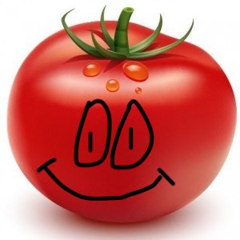

# Daniil

Обо мне  (это легенда)
Много лет занимаюсь iOS разработкой. Разрабатывал проекты на фрилансе и в команде. Работал в нескольких стартапах. Делал 2 стартапа самостоятельно. Руководил iOS разработкой и разработкой в целом ( iOS, android, front, back 

* Стек технологий: 
* Языки: Swift;
* Работа с фреймворками: UIKit, Foundation, Realm, Firebase, CoreData, CoreAnimation, Alamofire, MessageKit;
* Использование CocoaPods, SPM
* Работа с многопоточностью GCD;
* Работал с паттернами MVC, MVVM, VIPER;
* Следование принципам ООП: SOLID;
* Опыт работы с Git;

